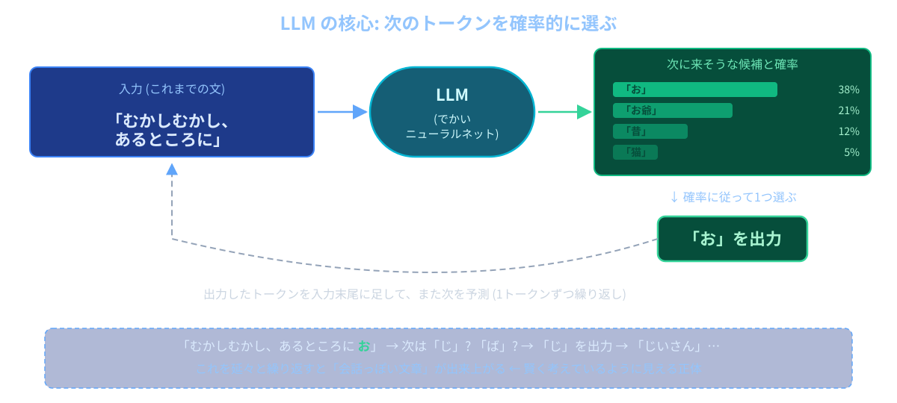
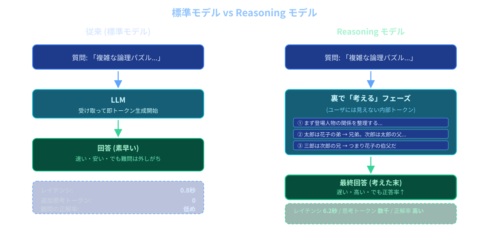

# 第1回: LLM入門 / コース全体像

**LLMアプリケーション基礎**

---

## 今日のゴール

LLMが何をする道具なのかを掴み、このコースで何を作るかをイメージする

---

## 今日の流れ

**前半**
- このコースで作るもの (chat-app デモ)
- LLMの仕組み (歴史 / トークン / 会話の正体)
- 主要なLLMと得意・苦手 / Reasoning モデル / マルチモーダル

**後半**
- ChatGPT Web / Claude.ai を触る演習
- 使う技術スタックの確認 / 俳句課題

---

## chat-app の全体像

8回かけて、この3つの要素(ブラウザ / FastAPI サーバー / OpenAI API)を組み上げていく

---

# このコースで作るもの

8回かけて **ChatGPT風アプリ** を自分の手で完成させる

- 複数の会話を保存・切り替えできる
- リロードしても消えない (SQLite保存)
- バックエンドで OpenAI API を呼んで応答を返す
- 前コース (Webアプリ基礎) の続編

---

# 最終成果物デモ (chat-app)

完成版を実際に動かしてみる

- 左サイドバー: 会話一覧 / 新しい会話ボタン / 削除
- 中央: メッセージのやり取り (user / assistant のバブル)
- バックエンド: FastAPI + SQLite
- AI: OpenAI API (`gpt-5.4-nano`)

---

# デモで見るポイント

ただ「動くな〜」で終わらせない

- **新しい会話を作る** → 左サイドバーに1行増える
- **会話を切り替える** → 中央の表示がパッと差し替わる
- **リロードしてみる** → 履歴は消えない (= SQLite に保存されている)
- **削除する** → その会話だけごっそり消える
- 見た目は ChatGPT のコピーではなく **手作りの最小実装** だが、骨は同じ

---

# 全8回のテーマ

| 回  | テーマ                           |
| --- | -------------------------------- |
| 1   | LLM入門 / コース全体像 |
| 2   | プロンプトエンジニアリング       |
| 3   | 復習回 (Web基礎)                 |
| 4   | OpenAI APIに初めて触れる         |
| 5   | FastAPIでChatバックエンド        |
| 6   | チャットUI + マルチターン会話    |
| 7   | 履歴の永続化 (SQLite)            |
| 8   | 複数会話の切替 + 仕上げ          |

---

# 進め方

- 「使う」→「作る」の順
  - 第1〜2回: ChatGPT を触って体感
  - 第4回以降: 自分のコードから呼ぶ
- 各回に **exercise/** スナップショットを用意
  - その回までの chat-app が動く状態で置いてある
  - 自分のコードから続けても、コピーから始めてもOK
- 第1回は **コード書きません** (ChatGPT / Claude.ai を触るのみ)

---

# そもそも LLM とは

LLM = **Large Language Model** (大規模言語モデル)

- 「言語モデル」= 文章を扱うAIモデル
- 「大規模」= めちゃくちゃ大量のテキストで学習されている
- 中身は超巨大なニューラルネットワーク
- 代表例: ChatGPT / Claude / Gemini

---

# LLM の現在地

- **2022年11月30日**: ChatGPT 一般公開
  - 5日で100万ユーザー、2ヶ月で1億MAU (史上最速のサービス成長)
- **2023年3月**: GPT-4 (テキスト+画像入力に対応)
- **2024年5月**: GPT-4o (音声・画像が滑らかに統合)
- **2025年8月**: GPT-5 系統に世代交代
- **2026年2月**: ChatGPT が週次9億ユーザーに到達、モデルは数ヶ月ごとに更新
- このコースは「今のフロンティア」を触りながら学ぶ

---

# 中身はざっくり: Transformer

- 2017年に Google が論文で発表したニューラルネットの構造
- 今の主要LLM (GPT / Claude / Gemini) はみんな Transformer をベース
- 細かい中身は本コースの範囲外
- 「**でかいニューラルネットの一種**」というイメージだけ持っておけばOK
- 名前を覚えておくと AI 系の記事が読みやすくなる

---

# LLM の核心: 次のトークンを予測する

- 入力の続きとして「次に来そうなトークン」を **確率的に1つ選ぶ** → それを末尾に足してまた予測…の繰り返し
- 「賢く考えてから喋っている」ように見えて、根本は **続きの予測**

---

# 「トークン」という単位 (直感だけ)

- LLMは文章を「単語」よりも細かい **トークン** という単位で扱う
- 文字より細かい単位がある、というイメージだけでOK
- 文の長さがトークン数に影響する (=長いほど重い)
- 具体的な数値の目安・コスト計算・コンテキストウィンドウは **第6回** で扱う

---

# 日本語は英語よりトークンが重い

- 英語: だいたい **1 token ≈ 4文字** ("hello" で1〜2トークン)
- 日本語: だいたい **1 token ≈ 3文字** ("こんにちは" で4トークン前後)
- 同じ内容を日本語で書くと、英語の **約1.77倍** トークンを消費する
- → 同じ会話量でも、日本語の方がコストが上がりがち
- 詳しいコスト計算は第6回。今日は「日本語は重い」とだけ覚えておけばOK

---

# なぜそれで会話っぽくなるのか

- 学習データの中に **会話・QA・指示と応答** が大量に含まれている
- 「質問されたら答える」「指示されたら従う」パターンを覚えている
- だから「次に来そうなトークン」を出すだけで応答として成立する
- = 内部に「人間と会話する型」が染み込んでいる

---

# 用語整理: アプリと モデルは別物

- **GPT** = OpenAI が作っている **モデル** の名前 (中身)
- **ChatGPT** = そのモデルをユーザーが触れるようにした **アプリ** (Web/スマホ)
- 同じ関係:
  - **Claude (モデル)** ↔ **Claude.ai (アプリ)**
  - **Gemini (モデル)** ↔ **Google の Gemini アプリ / API**
- このコースで作るのは「自分のアプリから OpenAI のモデル(API)を呼ぶ」もの
- = ChatGPT に近いものを、自分で組み上げ直す

---

# 主要な3つのLLM

| サービス | 提供元    | 2026年6月時点の主なモデル                |
| -------- | --------- | ---------------------------------------- |
| ChatGPT  | OpenAI    | GPT-5.5 / GPT-5.4 (本コースは nano を採用) |
| Claude   | Anthropic | Claude Fable 5 / Opus 4.8 / Sonnet 4.6   |
| Gemini   | Google    | Gemini 3.5 Flash / 3.1 Pro               |

- どれも「テキストを入れたらテキストを返す」点は同じ
- 細かい強み・スタイル・料金体系が違う
- 数ヶ月ごとに番号が上がる世界

---

# 各社のモデルの特徴 (ざっくり)

- **ChatGPT (OpenAI)**: 知名度No.1。エコシステムが広く、APIも充実。**本コースで使う**
- **Claude (Anthropic)**: 長文・コーディング・指示追従が強いと言われる
- **Gemini (Google)**: Google サービスとの連携、マルチモーダルが得意
- どれも数ヶ月単位で世代交代する世界 → **特定モデルに依存しすぎない感覚** が大事

---

# クラウド型だけじゃない: オープンソースLLM

- 主要3社のモデルは「クラウドAPI経由で借りる」型
- 一方で **モデル本体が公開されている** 系統もある
  - Meta の **Llama** 系
  - Alibaba の **Qwen** 系
  - **DeepSeek** 系 など
- 自分のPCやサーバーで動かせる (APIキー不要、データを外に出さなくて済む)
- 性能はフロンティアから半年〜1年遅れだが、近年差は縮んでいる
- 本コースでは **OpenAI API のみ** を扱う (環境構築の手間を回避するため)

---

# 新しい潮流: Reasoning モデル

- 従来は即返答 / Reasoning モデルは **裏で考えてから** 返答 (遅い・高い・正答率↑)
- 各社ラインナップあり: OpenAI `reasoning_effort` / Anthropic Extended Thinking / Gemini Deep Think

---

# Reasoning モデルの使いどころ

- **強い**: 数学・パズル・コードのバグ特定・複雑な比較検討
- **不要**: 雑談・要約・翻訳など軽い用途 (むしろ遅くなって損)
- **コスト**: 考える分だけ時間も料金もかかる (思考分のトークンも課金対象)
- 本コースで使う `gpt-5.4-nano` も Reasoning 対応
  - 「どれくらい考えるか」は `none` 〜 `xhigh` で切り替えられる
  - **第4回** で APIから体感
- 今日は **「そういうモデルがある」だけ覚えて帰ればOK**

---

# LLM が得意なこと

- 文章を **書く / 言い換える / 要約する**
- 翻訳
- アイデア出し・ブレスト
- コードの説明・雛形生成・バグの当たりをつける
- 形式変換 (箇条書きにする、JSON化する、表にする)
- 雑談・対話

---

# LLM が苦手なこと

- 正確な事実の保証 (もっともらしいウソを言うことがある)
- 最新の出来事 (学習時点までしか知らない)
- 厳密な計算・桁の多い算数
- 「自分が今何を知らないか」を正直に言うこと
- 一貫した長期記憶 (会話の外のことは覚えていない)

→ これらの「名前」と「対処」は **第2回** でまとめる

---

# テキスト以外も扱える (マルチモーダル)

最近のフロンティアモデルは入力がテキスト限定じゃない

- **画像入力**: 写真を見せて「これ何?」「このグラフを説明して」
- **音声入力**: 喋りかけてリアルタイム会話 (応答 232ms ≒ 人間並み)
- **動画入力**: 数十分〜1時間の動画を丸ごと食わせて要約させる
- このコースで使う `gpt-5.4-nano` は **テキスト中心** で十分
- 「LLM = 文字だけ」の固定観念は今日捨ててOK

---

# ハンズオン: ChatGPT Web を触ろう

https://chatgpt.com を開く

- アカウントがある人はログイン / なくても無料枠で試せる
- 今日は **入力欄に文章を投げて応答を見るだけ**
- コードは書かない / API も使わない
- このコースで一番「触って遊ぶ」回

---

# ハンズオン: Claude.ai を触ってみよう

https://claude.ai を開く

- アカウントがある人はログイン / なくても無料枠で試せる
- 今日は **入力欄に文章を投げて応答を見るだけ**
- ChatGPT と同じ質問をしてみて、応答の違いを感じてみるのも面白い

---

# 演習①: 得意ぽい質問を投げてみる

得意分野を **自分で発見する**

- 「次の文章を3行で要約して」+ 適当な長文を貼る
- 「Pythonで FizzBuzz を書いて」
- 「このカジュアルなメール文を、取引先向けの堅い言い回しに直して」
- 「フランス語に翻訳して」+ 短文
- 「以下の箇条書きを表に整理して」+ 適当な箇条書き

→ おそらくサクッと「それっぽい」答えが返ってくる

---

# 演習②: 苦手が出やすい質問を投げてみる

ボロが出るパターンを **わざと** 探す

- 算数: 「94443649860946 ÷ 38412112264423 は?」
- 最新情報: 「今日のニュースを3つ教えて」
- 自分のこと: 「私 (受講生本人のフルネーム) について教えて」
- 存在しないもの: 「『深海星座論』という本の要約を教えて」
- 自己整合性: 「今あなたが答えた内容、本当に正しい? もう一度確認して」

→ 自信たっぷりに **間違える / でっち上げる** 様子を観察してほしい

---

# 演習③: 同じ質問を2社に投げ比べる

同じプロンプトを ChatGPT と Claude.ai 両方に貼ってみる

- 例1: 「日本の桜の名所を5つ、地域がバラけるように選んで」
- 例2: 「FastAPI で `/healthz` エンドポイントを最小実装して」
- 例3: 「『推し活』を知らない人に1段落で説明して」

観察ポイント:
- 文体・敬語の固さの違い
- 列挙の数や順序の違い
- コードのスタイルの違い (どちらもだいたい動くはず)
- → **「LLMはどれも同じ」ではない** ことを体で覚える

---

# 演習で意識してほしい点

- **間違えることがある** ことを自分で確かめる
- **知らないことがある** (最新情報・固有情報) ことを確かめる
- 「もっともらしいけど嘘」がどんな顔で出てくるか観察
- 同じ質問の聞き方を変えると応答が変わることも体感

→ 第2回で「ハルシネーション」「知識カットオフ」として整理します

---

# 提出課題: ChatGPT に俳句を書かせよう

ChatGPT に **俳句を1句** 書かせて、**入力したプロンプト** と **出力された俳句** をセットで提出してもらいます

### 手順

1. https://chatgpt.com を開く
2. 自分の好きなテーマで **俳句を作って** とお願いする
   - 例: 「春の海をテーマに俳句を1句作ってください」
3. `session01/exercise/haiku.md` を開く（2つの見出しが入っている）
4. `# 入力したプロンプト` の下に、自分が打ったプロンプトを貼り付け
5. `# 出力された俳句` の下に、ChatGPT が返した俳句を貼り付け
6. 保存して `git add` → `git commit` → `git push` で GitHub に反映

**ポイント:** プロンプトの書き方で結果がどう変わるか試してみる (テーマ・季語・字余り指定など)

---

# このコースで使う技術スタック

- **言語**: Python (バックエンド) + HTML / CSS / JS (フロント)
- **Webフレームワーク**: FastAPI
- **DB**: SQLite
- **LLM**: OpenAI API (`openai` Python SDK)
- **モデル**: `gpt-5.4-nano`
  - 上位モデルに比べて安価 (入力 $0.20 / 出力 $1.25 per 1M トークン)

前コースと同じ技術の延長線上

---

## 本日のまとめ

### 学んだこと
1. **LLM** = 次のトークンを予測する大規模なモデル (Transformer ベース)
2. **代表選手** = ChatGPT / Claude / Gemini + オープンソース勢
3. **新しい流れ** = Reasoning モデル (考えてから答える) / マルチモーダル (画像・音声・動画)
4. **得意** = 文章生成・要約・コード補助 / **苦手** = 事実・最新情報・計算
5. このコースは8回で **複数会話を扱える ChatGPT風アプリ** を作る

---

### 次回予告
**第2回: プロンプトエンジニアリング**
良い結果を引き出すプロンプトの書き方を、コードを書く前に「言葉で」マスターする。ハルシネーション/知識カットオフの正体、system/user プロンプト、Few-shot や構造化出力まで扱う。

---

## 提出物

ChatGPT に書かせた俳句を貼り付けたファイルをフォームから提出してください:

1. `haiku.md` のGitHubのURL
   - 例: `https://github.com/ユーザー名/リポジトリ名/blob/main/session01/exercise/haiku.md`

お疲れ様でした！
