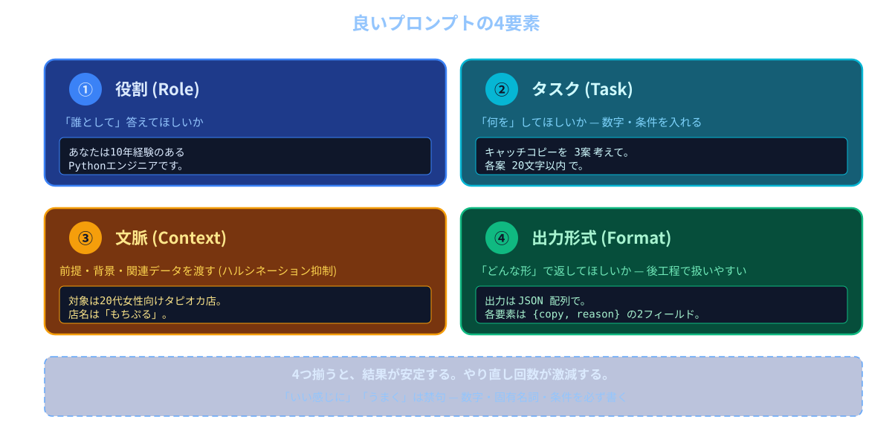
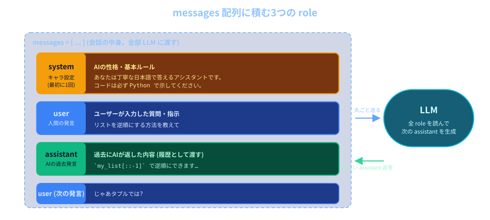

# 第2回: プロンプトエンジニアリング

**LLMアプリケーション基礎**

---

## 今日のゴール

良い結果を出すプロンプトの書き方を、コードを書く前に「言葉で」マスターする

---

## 今日の流れ

**前半**
- LLMの限界（ハルシネーション / 知識カットオフ）
- プロンプトの基本（目的 / 制約 / フォーマット）

**後半**
- system と user / Few-shot / 構造化出力 / Chain of Thought
- 演習: 学校紹介YouTube動画の原稿をChatGPTに書かせる

---

## chat-app の全体像


今日は ChatGPT Web を触るだけ。第4回以降、この図を自分の手で実装していく

---

## 第1回で気づいたこと

- 「ときどき間違える」
- 「最近のことを知らない」
- 「同じ質問でも答えが微妙に違う」
- これらには名前があり、対処法もある
- 今日はその「対処法 = プロンプト」を学ぶ

---

## LLMの限界 ①: ハルシネーション

- 知らないことも **自信たっぷりに作り話してしまう** 現象
- 「もっともらしい嘘」が混ざる
- 例: 存在しない論文タイトル、架空のAPI関数名、間違った歴史的事実
- 「次のトークンを予測する」仕組み上、知らなくても文を続けてしまう

---

## LLMの限界 ②: 知識カットオフ

- 学習データの **時点より後** の出来事は知らない
- 「2025年12月の出来事は?」と聞いても答えられない or 想像で答える
- モデルごとに「いつまでのデータで学習したか」が決まっている
- 最新情報は **こちらから渡す** 必要がある

---

## だからプロンプトが大事

- LLMの「知らない」「思い込み」を こちら側で補う
- 必要な前提・文脈・最新情報を **明示的に渡す**
- 何をしてほしいか / どんな形式で答えてほしいかを **具体的に書く**
- これが「プロンプトエンジニアリング」

---

## プロンプトとは

- LLMへの「入力テキスト」全体のこと
- 質問だけでなく、指示・前提条件・例・出力フォーマットなど **全部含む**
- プロンプトの質 = 出力の質
- 「魔法の呪文」ではなく、人に頼みごとをする時のコツと同じ

---

## 悪いプロンプトの例

```text
メール書いて
```

- 何のメール? 誰宛? どんな目的? トーンは?
- LLMは推測で書くしかなく、毎回違うものが出てくる
- やり直しが多発する

---

## 良いプロンプトの例

```text
取引先の田中様宛に、来週月曜の打ち合わせを30分後ろ倒しに
してほしいというお願いメールを書いてください。

- 丁寧だがかしこまりすぎない
- 200字程度
- 件名も含めて
```

- 宛先 / 目的 / 制約 / 形式 が明示されている
- 結果が安定する

---

## 良いプロンプトの4要素



---

## ① 目的の明確化

```text
新規顧客にSNSで拡散されることを目的に、
20代女性向けタピオカ店「もちぷる」のキャッチコピーが欲しい。
成功条件: 親しみやすく、思わずシェアしたくなるトーン。
```

- 「何のために / 誰に向けて / 何が成功か」を最初に伝える
- 「やり方」より **「達成したい状態」** を書く
- Reasoningモデルは目的が明確なら、途中の段取りは自分で組んでくれる
- 役を演じさせる(「あなたは〜です」)より、目的を伝える方が結果が安定する

---

## 目的を曖昧にする vs 明確にする

悪い:

```text
このコードをレビューして
```

良い:

```text
明日の本番デプロイ前に、致命的バグだけを止めたい。
以下のコードを見て、入力バリデーション・エラー処理・
セキュリティ面で「デプロイ中止すべき問題」だけ報告してください。
```

- 「何のためにやるか / 何が成功か」が分かるとモデルの判断軸が定まる
- 「全部の改善点を挙げて」と違い、報告が絞られてノイズが消える
- 肩書を付けるより、達成したい状態を書くほうが効果が大きい

---

## ② 制約

- 目的だけだとモデルの解釈が広がりすぎる → **範囲を絞る**
- 数字 / 個数 / 長さ / 例外条件で **やってほしくないこと** まで書く
- 「いい感じに」「うまく」は禁句

例:

```text
- 3案出してください
- 各案は20字以内
- 英単語は使わないでください
- 「最高」「一番」など誇張表現はNG
```

---

## ③ 文脈

```text
対象は20代女性向けの新規タピオカ店「もちぷる」。
原宿に来週オープン予定。差別化ポイントは
「フルーツたっぷり・低糖質」。
以上を踏まえて、SNS拡散を狙うキャッチコピーを書いてください。
```

- モデルが **知らない情報** を先に渡す(自社固有・最新情報・社内ルールなど)
- 第1回で学んだ「ハルシネーション」「知識カットオフ」を **こちら側で補う** のがこれ
- 目的が同じでも、前提が違えば答えは変わる → **背景を共有してから依頼する**

---

## 文脈の渡し方のコツ

- 関係ある情報だけを **絞って** 渡す(無関係な情報はノイズになる)
- 「前提として〜」「以下を踏まえて〜」のように **指示と前提を分けて** 書くと読みやすい

---

## ④ 出力フォーマットの指定

```text
以下を箇条書きで出力してください:
- タイトル
- 要約(80字以内)
- キーワード3つ(カンマ区切り)
```

- 形を指定すると **後工程で使いやすい**
- 第4回以降、APIから受け取って処理する時に超重要になる
- 今日のうちに「形を指示する習慣」を付ける

---

## ChatGPT の画面構成 (復習)

- 1つの会話 = 1つの「コンテキスト」
- 同じ会話の中では前のやり取りを覚えている
- 別の話を始めたいときは「新しいチャット」を作る
- これが第6回以降のマルチターン会話の土台

---

## system プロンプトと user プロンプト

- **system プロンプト**: AIの **キャラ設定・基本ルール** を書く場所(裏側の指示)
- **user プロンプト**: 毎回の **ユーザーの発言**
- ChatGPT Web版だと「Custom Instructions」「カスタムGPT」が system 相当
- APIを使う第4回以降、自分で `role: "system"` を指定するようになる

---

## system / user / assistant のイメージ



- system は会話の最初に1回 / user は毎回のユーザー発言 / assistant は過去のAI発言 (履歴)

---

## Few-shot プロンプト

- 「**例を見せて** から本番のタスクをやらせる」手法
- 言葉で説明しにくいパターンを **例だけで** 伝えられる
- 分類・抽出・フォーマット統一で特に効く

---

## Few-shot の例(感情分類)

```text
以下のレビューを ポジティブ / ネガティブ / 中立 に分類してください。

例:
入力: 「最高でした、また来ます!」 → ポジティブ
入力: 「値段の割に普通」 → 中立
入力: 「店員の態度が悪かった」 → ネガティブ

本番:
入力: 「料理は美味しかったが待ち時間が長すぎた」 → ?
```

- 例を3つ程度見せるだけで精度が大きく上がる

---

## Zero-shot / One-shot / Few-shot

- **Zero-shot**: 例なし、指示だけ
- **One-shot**: 例を1つ
- **Few-shot**: 例を数個(2〜5個程度)
- 例が多ければよいわけではない(プロンプトが長くなる = コストも増える)
- 「少ない例で十分な精度が出る」のがLLMの強み

---

## 構造化出力 (JSON)

```text
以下の自己紹介文から、名前・年齢・趣味を抽出して
JSON形式で出力してください。他のテキストは出さないでください。

入力: 「はじめまして、田中太郎です。28歳で、休日は登山と読書をしています」

出力フォーマット:
{
  "name": "...",
  "age": 0,
  "hobbies": ["...", "..."]
}
```

- プログラムで `json.loads()` できる形にする
- 第4回以降、APIの返答をコードで処理する時に必須

---

## 構造化出力のコツ

- 出力例(スキーマ)を **そのまま見せる**
- 「他のテキストは出さないでください」と明示
- フィールド名・型 を固定する
- OpenAI には JSON 出力を保証する「Structured Outputs」という専用機能もある(本コースでは扱わない。興味があれば調べてみよう)。今日はプロンプトだけで実現する

---

## Chain of Thought (CoT) の触り

- 「**段階的に考えてから** 答えてください」と指示する手法
- 数学・論理・複雑な推論で精度が上がる
- 中間ステップを文字に起こすことで、LLM自身が整理できる

---

## CoT の例

```text
次の問題を、考える手順を1ステップずつ書き出してから
最終的な答えを出してください。

問題: りんごが3袋あり、各袋には4個入っています。
2個食べた後、残りを5人で分けると、1人何個になりますか?
```

- 「ステップを書き出して」がポイント
- いきなり答えを出させると間違えやすい問題でも、正解率が上がる

---

## Reasoningモデルとの関係

- 最近のモデル(gpt-5.4-nano など)は **裏で勝手にCoTをやってくれる** 「Reasoningモデル」
- 第4回で API から `reasoning_effort` を切り替えるデモをやる
- 「プロンプトでCoT」も「モデル機能としてのReasoning」も、根は同じ発想
- 今日は **プロンプト側でできること** を体に染み込ませる
- ReasoningモデルではCoTがないほうが精度が出る場合がある

---

## プロンプト改善の手順

1. まず雑に書いて投げてみる
2. 結果のどこが不満かを言語化する
3. 不満を解消する要素を1つ足す(目的 / 制約 / 例 / フォーマット)
4. もう一度投げる
5. 満足するまで繰り返す

---

## やりがちな失敗

- 一気に色々詰め込みすぎて、何が効いたか分からなくなる
- 「もっといい感じに」と曖昧な追記をする
- 例(Few-shot)が偏っていてLLMが偏った答えを返す
- フォーマット指定したのに「ここに余計な前置きを入れないで」を書き忘れる

---

## 提出課題: 学校紹介YouTubeの原稿を書かせよう

ChatGPT に **この学校(LLMアプリケーション基礎コース)を紹介する YouTube 動画の原稿** を書かせて、**入力したプロンプト** と **出力された原稿** をセットで提出してもらいます

### 手順

1. https://chatgpt.com を開く
2. 今日学んだ **目的 / 制約 / 文脈 / 出力形式** を活かしてプロンプトを書く
3. `session02/exercise/youtube_script.md` を開く（2つの見出しが入っている）
4. `# 入力したプロンプト` の下に、自分が打ったプロンプトを貼り付け
5. `# 出力された原稿` の下に、ChatGPT が返した原稿を貼り付け
6. 保存して `git add` → `git commit` → `git push` で GitHub に反映

**ポイント:** 「誰に向けた / 何分くらいの / どんなトーンの」動画かを最初に決める。Few-shot や 出力形式の指定 も使ってOK

---

## 本日のまとめ

### 学んだこと
1. **LLMの限界** = ハルシネーション と 知識カットオフ
2. **プロンプトの4要素** = 目的 / 制約 / 文脈 / 出力形式
3. **system / user** プロンプトの違い
4. **Few-shot** = 例を見せてパターンを伝える
5. **構造化出力 (JSON)** で後工程につなげる
6. **Chain of Thought** で段階的に考えさせる

---

### 次回予告
**第3回: 復習回（Web基礎）**
FastAPI / fetch / SQLite を **思い出す** 回。LLMはまだ使わず、純粋にWeb基礎を復習して echo API + 簡易UI を作る。第4回からいよいよ OpenAI API に触る。

---

## 提出物

ChatGPT に書かせた学校紹介YouTubeの原稿を貼り付けたファイルをフォームから提出してください:

1. `youtube_script.md` のGitHubのURL
   - 例: `https://github.com/ユーザー名/リポジトリ名/blob/main/session02/exercise/youtube_script.md`

お疲れ様でした！
