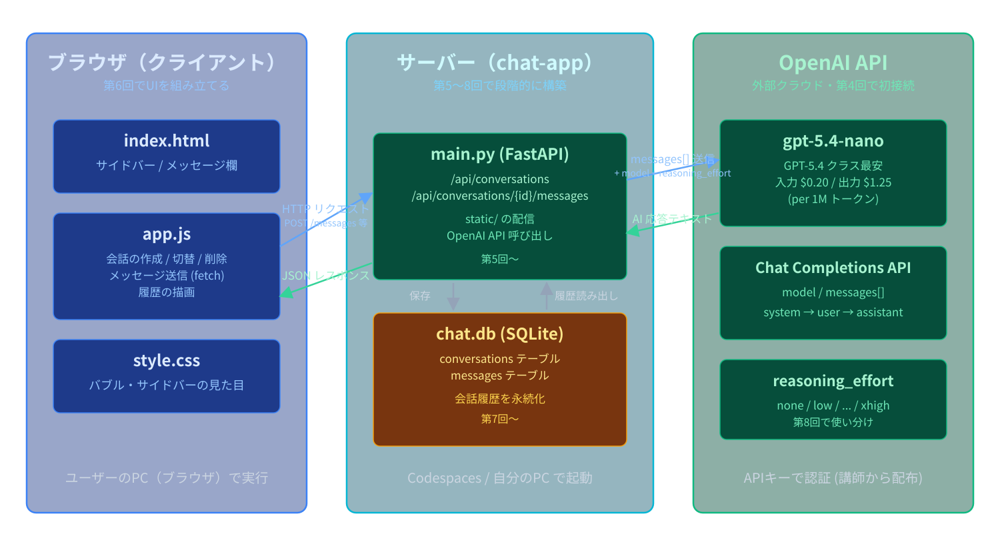
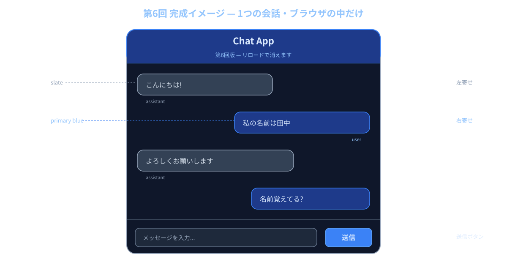
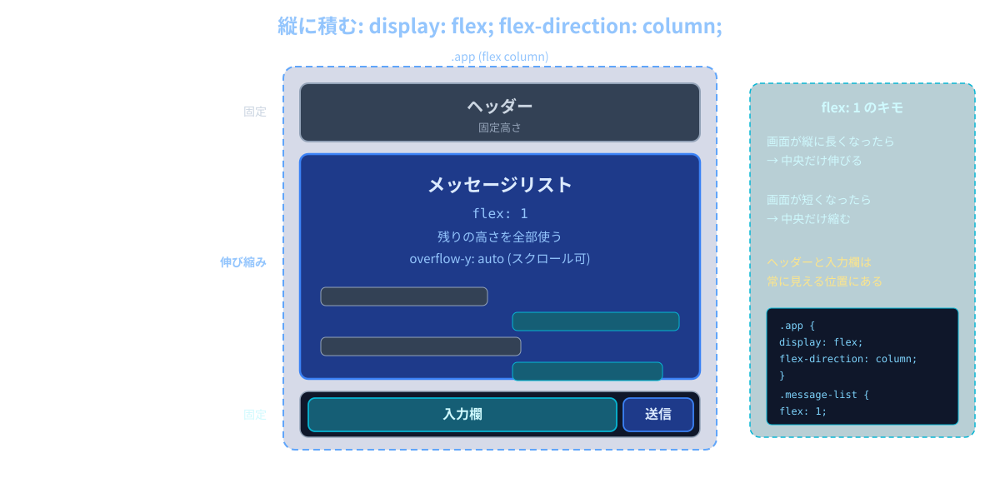
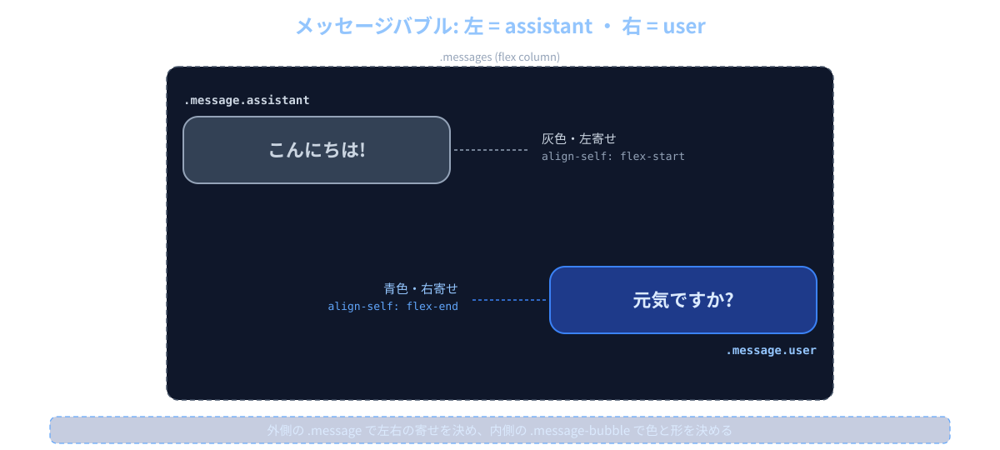
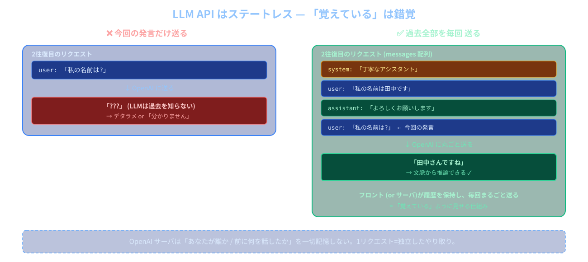
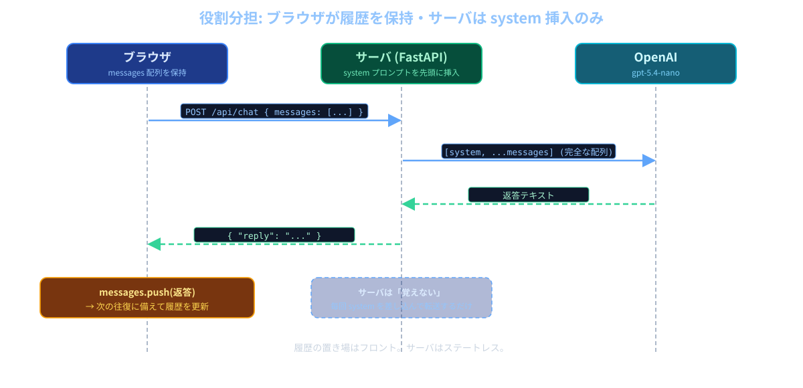
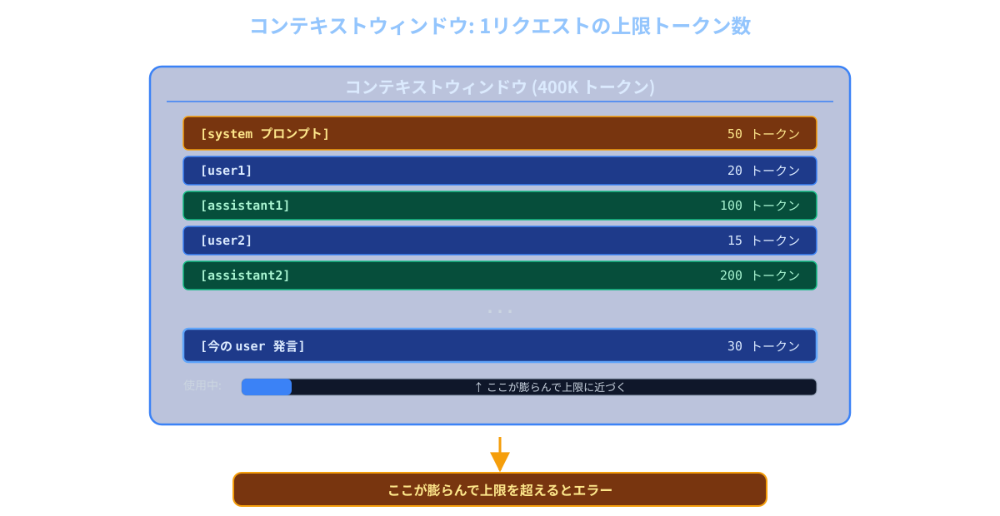
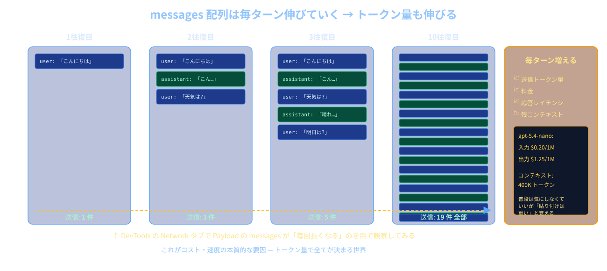

# 第6回: チャットUI + マルチターン会話

**LLMアプリケーション基礎**

---

## 今日のゴール

ブラウザで動く **チャット画面** を作り、AIが「前の発言を覚えている」状態を実現する

---

## 今日の流れ

**前半**
- チャットUIの設計（HTML/CSS でメッセージバブル）
- fetch で1往復してみる

**後半**
- マルチターン会話 — `messages` 配列に履歴を積む
- トークン と コンテキストウィンドウ の直感
- 演習: 1会話・メモリ保持版（リロードで消える）を完成させる

---

## chat-app の全体像



今日は左(ブラウザ)に **チャット画面** を作り、中央に **会話履歴(メモリ)** を持たせる

---

## 前回までの状況

- 第5回で `POST /api/chat` の **バックエンド** ができた
- でも Swagger UI から1回ずつ叩くだけだった
- 「会話」というより「1往復ずつのお問い合わせフォーム」
- 今日: ブラウザに **チャットらしい画面** を載せ、**話の流れ** を持たせる

---

## 完成イメージ(第6回時点)



---

## まだ作らないもの(第7回以降)

- サイドバー / 会話の切り替え → 第8回
- DBに会話を保存 → 第7回
- リロードしても残る → 第7回

今日は **1つの会話だけ・ブラウザの中だけ** に集中する。

---

# 前半: チャットUIを組む

---

## チャット画面の3パーツ

1. **メッセージリスト** — 上に積み上がる発言の流れ
2. **入力欄** — 下にあるテキストエリアと送信ボタン
3. **メッセージバブル** — 1つ1つの発言の吹き出し

この3つだけ作れば「チャットっぽい画面」になる。

---

## 画面のレイアウト(縦に積む)



- `display: flex; flex-direction: column;`
- リスト部分だけが `flex: 1` で伸び縮みする

---

## メッセージバブルの構造

```html
<div class="message user">
  <div class="message-bubble">こんにちは</div>
</div>

<div class="message assistant">
  <div class="message-bubble">こんにちは!</div>
</div>
```

- 外側の `.message` で **左右どっち寄せ** かを決める
- 内側の `.message-bubble` で **色と形** を決める

---

## バブルの色分けイメージ



- `align-self: flex-end` で user は右寄せ
- `align-self: flex-start` で assistant は左寄せ

---

## CSS のキモ(抜粋)

```css
.message.user {
  align-self: flex-end; /* 右寄せ */
}
.message.user .message-bubble {
  background-color: #2563eb; /* 青 */
  color: white;
}

.message.assistant {
  align-self: flex-start; /* 左寄せ */
}
.message.assistant .message-bubble {
  background-color: #f3f4f6; /* 灰 */
}
```

---

## 入力欄: textarea + button

```html
<form id="chat-form" class="input-area">
  <textarea
    id="chat-input"
    rows="2"
    placeholder="メッセージを入力..."
  ></textarea>
  <button type="submit">送信</button>
</form>
```

- `<input>` ではなく `<textarea>` を使うのが定番
- 長文や改行を入れたいことが多いから

---

## キー操作のお作法

- **Enter** で送信
- **Shift+Enter** で改行
- 日本語の変換確定の Enter では送信しない (`isComposing`)

```js
input.addEventListener("keydown", (e) => {
  // isComposing = 日本語入力(IME)で変換中かどうか
  if (e.key === "Enter" && !e.shiftKey && !e.isComposing) {
    e.preventDefault(); // 改行をキャンセル
    sendMessage();
  }
});
```

ChatGPT などほとんどのチャットUIがこの挙動。

---

## fetch で1往復(まずは最小形)

```js
async function sendOnce(text) {
  // 第5回で作った /api/chat をそのまま呼ぶ ({ "message": ... } 形式)
  const res = await fetch("/api/chat", {
    method: "POST",
    headers: { "Content-Type": "application/json" },
    body: JSON.stringify({ message: text }),
  });
  const data = await res.json();
  return data.reply;
}
```

- これだけだと **1往復で会話が途切れる**(AIは前の発言を忘れる)
- → ここから「履歴を持つ」話に進む(リクエストの形も後で変える)

---

# 後半: マルチターン会話

---

## マルチターンとは

- **マルチターン (multi-turn) 会話** = 何往復もする会話
- 「前の発言を踏まえて答えてほしい」
- 例:
  - User: 「私の名前は田中です」
  - AI: 「よろしくお願いします」
  - User: 「私の名前は何でしたか?」
  - AI: 「田中さんですね」 ← **これを実現したい**

---

## LLM API の重要な性質: ステートレス

- OpenAI の API は **過去のやり取りを記憶しない**
- 1回のリクエストは、それ単独で完結している
- サーバは「あなたが誰か」「前に何を話したか」を **覚えていない**

```
リクエスト1: 「私の名前は田中です」 → 「よろしく」
リクエスト2: 「名前は?」 → 「???」(何も知らない)
```

---

## どうすれば「覚えている」ように見せるか



---

## messages 配列の役割

```js
let messages = [
  { role: "user",      content: "..." },
  { role: "assistant", content: "..." },
  { role: "user",      content: "..." },
  ...
];
```

- フロントが **会話履歴を全部記憶しておく** 変数
- 発言があるたびに push する
- 送信時には **これを丸ごとサーバに渡す**

---

## 今回の役割分担



サーバは **覚えない**。フロントが履歴の置き場。

---

## 送信のシーケンス(1往復ぶん)

```
ユーザーが入力 → 送信ボタン
   |
   |  1. messages.push({role:"user", content:入力})
   |  2. 画面にユーザー発言を表示
   |  3. 「考え中...」表示
   |
   ▼
fetch("/api/chat", { body: {messages} })
   |
   |  サーバ: system + messages を OpenAI に渡す
   |  サーバ: 返答テキストだけ返す
   |
   ▼
return {reply: "..."}
   |
   |  4. messages.push({role:"assistant", content:reply})
   |  5. 「考え中...」を返答で置き換え
```

---

## コードの本体(抜粋)

```js
async function sendMessage() {
  const content = input.value.trim();

  messages.push({ role: "user", content }); // 履歴に追加
  appendMessage("user", content); // 画面に追加
  const loading = appendMessage("assistant", "考え中...", "loading");

  const res = await fetch("/api/chat", {
    method: "POST",
    headers: { "Content-Type": "application/json" },
    body: JSON.stringify({ messages }), // 履歴を丸ごと送る
  });
  const { reply } = await res.json();

  messages.push({ role: "assistant", content: reply });
  loading.querySelector(".message-bubble").textContent = reply;
}
```

---

## `/api/chat` のリクエストスキーマが変わる

第5回までの `POST /api/chat` は **単発の質問** を受け取っていた:

```json
{ "message": "こんにちは" }
```

第6回からは **会話履歴をまるごと** 受け取る形に変える:

```json
{
  "messages": [
    { "role": "user",      "content": "私の名前は田中です" },
    { "role": "assistant", "content": "よろしくお願いします" },
    { "role": "user",      "content": "名前は?" }
  ]
}
```

なぜ変える?: 履歴を毎回送らないとAIは前の発言を覚えてくれないから。

---

## Pydantic モデルも書き換える

第5回の `ChatRequest(message: str)` は **捨てて** 、新しい形に置き換える:

```python
class Message(BaseModel):
    role: str = Field(pattern="^(user|assistant)$")
    content: str = Field(min_length=1, max_length=4000)

class ChatRequest(BaseModel):
    messages: list[Message] = Field(min_length=1)
```

- `Message` = 1発言ぶん (`role` + `content`)
- `ChatRequest` = その配列を1つ持つだけ
- `role` は `"user"` か `"assistant"` のどちらかに限定

これでフロントから来る JSON をそのまま型チェックできる。

---

## サーバ側はびっくりするほどシンプル

```python
@app.post("/api/chat")
def chat(req: ChatRequest):
    # system を先頭に差し込む
    messages_for_api = [{"role":"system", "content": SYSTEM_PROMPT}]
    for m in req.messages:
        messages_for_api.append({"role": m.role, "content": m.content})

    response = client.chat.completions.create(
        model="gpt-5.4-nano",
        messages=messages_for_api,
        reasoning_effort="low",
    )
    return {"reply": response.choices[0].message.content}
```

サーバは **履歴を持たない**。覚えてるのはフロントだけ。

---

## なぜ system はサーバ側で差し込む?

- システムプロンプトはアプリの性格を決める大事な設定
- フロントから自由に書き換えられたら、AIの振る舞いを乗っ取られる
- 「絶対に変えてほしくないもの」は **サーバ側で固定** する
- 第8回で「会話ごとに system を変える」のもサーバ管理

---

## ここで重要な気付き

> 会話が長くなるほど、毎回送るデータも長くなっていく

- 5往復目では「過去5往復ぶん全部」を毎回送っている
- 50往復目では「過去50往復ぶん全部」を毎回送っている
- これがLLMアプリの **本質的な特性**

→ 「トークン」と「コンテキストウィンドウ」の話につながる

---

# トークンとコンテキストウィンドウ

---

## LLM は「文字」を見ていない

- LLM が見ているのは **トークン (token)** という単位
- 文章をトークンに分解してから処理する
- 英語: 単語1個 ≒ 1トークン(ざっくり)
- 日本語: 1文字 ≒ 1〜2トークン(ざっくり)
- 「次のトークンを予測する」のがLLMの仕事(第1回でやった)

---

## トークン分割のイメージ

英語:

```
"Hello, world!"  →  [Hello] [,] [ world] [!]   = 4トークン
```

日本語:

```
"こんにちは"     →  [こん] [にち] [は]          = 3トークン
"今日はいい天気" →  [今日] [は] [いい] [天気]    = 4トークン
```

※ 実際の分割はモデルのトークナイザに依る。あくまでイメージ。

---

## なぜトークンが大事?

LLMの世界では、ほとんどすべてが **トークン基準**で測られる:

| 何         | 単位                                            |
| ---------- | ----------------------------------------------- |
| 料金       | 100万トークンあたり $                           |
| 速度       | 1秒あたり何トークン生成できるか                 |
| 入力の上限 | コンテキストウィンドウ = 何トークンまで詰めるか |
| 出力の上限 | 1回の返答で最大何トークン                       |

→ **文字数ではなく、トークン数の感覚を持つ**

---

## gpt-5.4-nano のスペック

- 入力: **$0.20 / 1Mトークン**
- 出力: **$1.25 / 1Mトークン**
- コンテキストウィンドウ: **400K トークン**
- 最大出力: **128K トークン**

「コンテキストウィンドウ」= **1回のリクエストに詰め込める最大トークン数**

system + 会話履歴 + 新しい質問 が全部この枠の中に入る必要がある。

---

## コンテキストウィンドウのイメージ



---

## 会話が長くなると何が起きる?

毎ターン、過去の履歴を **全部** 送り直す設計だから:

- **(a) 送信トークン量が増える** → リクエストごとの料金が上がる
- **(b) コンテキストウィンドウの上限に近づく** → 上限超えるとエラー
- **(c) 応答が遅くなる** → 処理する量が増える

短い会話なら気にならないが、長文を貼り続けると一気に消費する。

---

## ざっくり感覚を持つ

`gpt-5.4-nano` 入力 $0.20 / 1Mトークン:

| やり取り規模             | 累積入力トークン (目安) | 料金感      |
| ------------------------ | ----------------------- | ----------- |
| 5往復 (短文)             | ~500                    | ほぼ0円     |
| 50往復 (短文)            | ~25,000                 | $0.005      |
| 1万字の文書を貼って5往復 | ~50,000                 | $0.01       |
| 400Kウィンドウぎりぎり   | 400,000                 | $0.08 (1回) |

普段は気にしなくていい。でも **「貼り付けは重い」** ことだけは知っておく。

---

## DevTools で実際に見てみよう (演習中)

1. F12 で DevTools を開く
2. **Network タブ** を選ぶ
3. 何往復か会話する
4. リストに並ぶ `chat` を1つ目→2つ目→… の順にクリック
5. **Payload** を見ると `messages` 配列が **毎回長くなっている**

さらに Console で:

```js
__debug.show(); // フロント側の messages を直接覗く
```

---

## 「毎回まるごと送る」の確認



---

# 演習

---

## 今日の演習

`session06/exercise/` の chat-app を起動して、次の3つを体験する:

1. **マルチターン会話**: 名前を覚えてくれることを確認
2. **リロードで消える**: ブラウザを更新すると会話が消える
3. **Payload観察**: DevTools で `messages` が長くなる様子

`exercise/README.md` の手順に沿って進める。

---

## 起動手順(おさらい)

```bash
# 1. APIキーを export
export OPENAI_API_KEY=sk-...

# 2. 依存パッケージ(初回のみ)
pip install -r requirements.txt

# 3. サーバ起動
cd session06/exercise
python main.py
```

ブラウザで `http://localhost:8000` を開く。

---

## 余裕がある人向け: 改造アイデア

- system プロンプトを書き換えて性格を変えてみる(関西弁、ツンデレ等)
- 「リセット」ボタンを追加して `messages = []` に戻す
- ヘッダーに今のメッセージ数 (`messages.length`) を表示する
- 入力欄を Markdown 対応にしてみる(`marked.js` 等)

第8回までに必須なのは「マルチターンで動くこと」だけ。

---

## 本日のまとめ

### 学んだこと
1. **チャットUI** = メッセージリスト + 入力欄 + バブル
2. **LLM API はステートレス** — サーバは過去を覚えない
3. 「覚えている」ように見せる = **毎回 messages 配列ごと送る**
4. 会話が長くなる ≒ **送信トークンが増える**
5. `gpt-5.4-nano` のコンテキストウィンドウは **400K** と広いが無限ではない

---

### 次回予告
**第7回: 履歴の永続化 (SQLite)**
問題: リロードで会話が消える。解決策はサーバ側で **SQLite** に保存すること。`messages` テーブルを作って発言を保存し、起動時に過去ログを読み込んで画面に復元する。フロントが履歴を持って送るのはやめ、サーバ管理に切り替える。

---

## 提出物

実習で作成したファイルをフォームから提出してください:

1. `session06/exercise/` の chat-app（マルチターン版）の GitHub のURL
   - 例: `https://github.com/ユーザー名/リポジトリ名/tree/main/session06/exercise`

お疲れ様でした！
